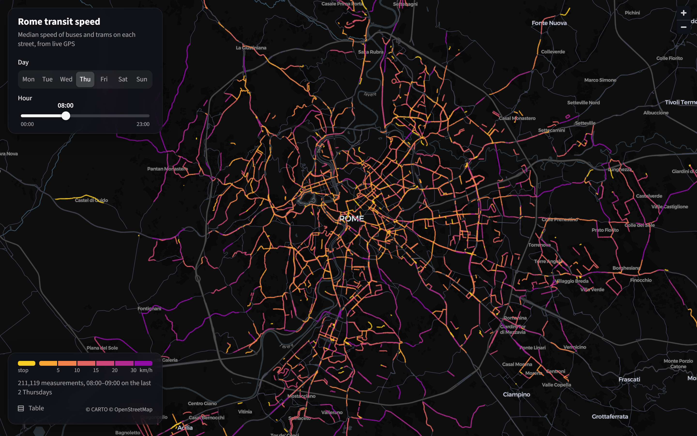
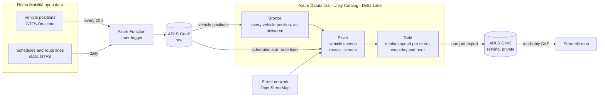

<div align="center">

# Rome transit speed

**Median speed of Rome's buses and trams, street by street and hour by hour.**

An Azure lakehouse built on the city's live GPS feed, collected every 20 seconds<br>
and served on an interactive map.

[](https://rome-transit-speed.streamlit.app/)


[](https://rome-transit-speed.streamlit.app/)

</div>

## Contents

- [About](#about)
- [Architecture](#architecture)
- [Pipeline](#pipeline)
- [Design decisions](#design-decisions)
- [Data quality](#data-quality)
- [Repository layout](#repository-layout)
- [Possible improvements](#possible-improvements)
- [License and acknowledgments](#license-and-acknowledgments)

## About

Roma Mobilità publishes the position of every bus and tram in the city as a GTFS-Realtime
feed, refreshed about every 30 seconds. This project calculates each vehicle's speed from
the distance and time between its GPS positions, matches it to OpenStreetMap streets and
builds a weekly profile of median speeds.

On the map, choose a day and an hour. Hovering over a street shows its speed, how many
vehicles and routes the figure is based on, and how often they were moving.

Every day the feed delivers about 2.8 million vehicle positions, 290 MB of raw data. The
map is built from the last 90 days and covers about 5,100 streets.

## Architecture



## Pipeline

| Layer | Where | What happens |
|---|---|---|
| **Ingestion** | [`ingestion/function_app`](ingestion/function_app/function_app.py) | Every 20 s an Azure Function downloads the vehicle positions feed and stores each snapshot as a file in ADLS Gen2, partitioned by date and hour. Once a day it stores the schedules and route lines. |
| **Bronze** | [`bronze_vehicle_positions`](transform/bronze_vehicle_positions.py) | Parses those files into a Delta table, one row per vehicle with every field Rome fills. Loads incrementally with Auto Loader: each run reads only files it has not seen. |
| **Silver** | [`silver_vehicle_segments`](transform/silver_vehicle_segments.py) | Removes duplicate and outdated positions, then calculates each vehicle's speed between its consecutive positions on a trip. |
| | [`silver_streets`](transform/silver_streets.py) | Pulls Rome's street network from OpenStreetMap. |
| | [`silver_route_streets`](transform/silver_route_streets.py) | Matches each bus and tram route to the streets it runs on. |
| **Gold** | [`gold_street_speed`](transform/gold_street_speed.py) | Matches each speed measurement to the nearest street on its route, then calculates the median speed for every street, weekday and hour. Runs quality checks and exports the result for the map. |
| **Serving** | [`app/map.py`](app/map.py) | A Streamlit app on Community Cloud reads the data from a private container and draws the map. |

## Design decisions

- **The feed is checked every 20 s.** Rome publishes new positions about every 30 s, so
  checking more often means no update is missed. Each update is saved under its own
  timestamp, so downloading it twice creates no duplicate.
- **Speed is calculated, not read.** Only about 20 % of vehicles report a speed, and those
  values are noisy, some over 200 km/h. Speed comes from the distance and time between
  consecutive positions.
- **Speeds are matched only to streets on the vehicle's route.** The nearest street is often
  a side street or a crossing. Limiting the match to the route's own streets keeps each
  speed on the street the vehicle actually drove.
- **Median, not mean.** Most measurements cluster near stops and lights, with a few fast ones.
  The median shows the typical speed and is not pulled by outliers.
- **The map's data is not public.** The app loads it from a private storage container
  with a read-only key. A public link would let anyone download the files without limit,
  and every download is billed. The app fetches the data at most once an hour.

## Data quality

If no new positions arrive for an hour, the daily run stops before anything is recalculated.
Before publishing, the results are checked for impossible values, duplicates and speeds
placed too far from their street, and if a check fails the map keeps the previous data.
A street gets a speed for a weekday and hour only from at least 20 measurements.

## Repository layout

```text
.
├── ingestion/
│   ├── function_app/     Azure Function
│   └── local_test.py     prints a sample of the feed
├── transform/            Databricks notebooks
├── app/
│   ├── map.py            Streamlit map
│   └── style.css         map styles
├── .streamlit/
│   └── config.toml       dark theme
└── docs/
    └── map.png           screenshot for this README
```

## Possible improvements

- Draw whole streets instead of street pieces.
- Extend incremental loading from bronze to silver and gold.
- Add other cities that publish their transit data in the same GTFS format.

## License and acknowledgments

Released under the [MIT License](LICENSE).

- Transit data: [Roma Mobilità](https://romamobilita.it/) open data, GTFS and GTFS-Realtime
- Street network: © [OpenStreetMap](https://www.openstreetmap.org/copyright) contributors
- Basemap: © [CARTO](https://carto.com/attributions)
